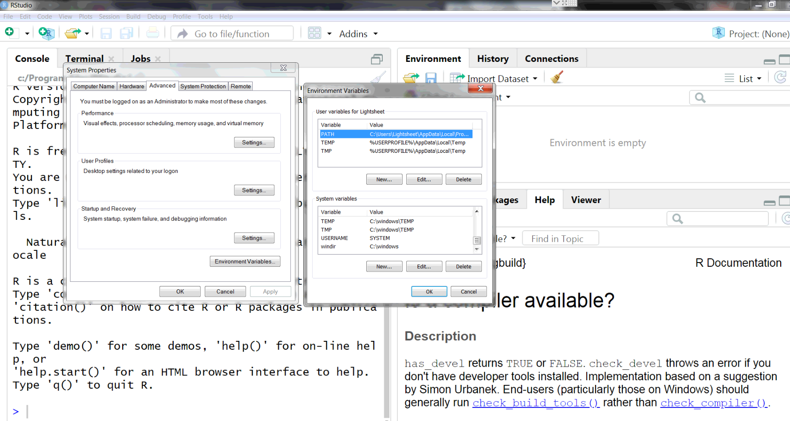
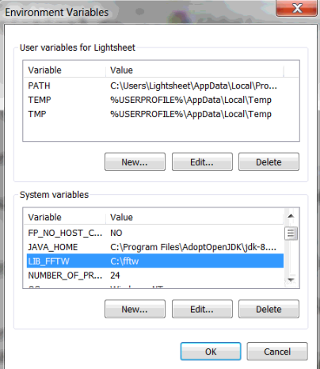
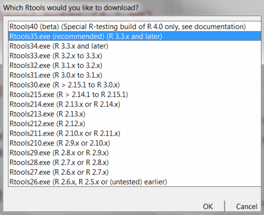
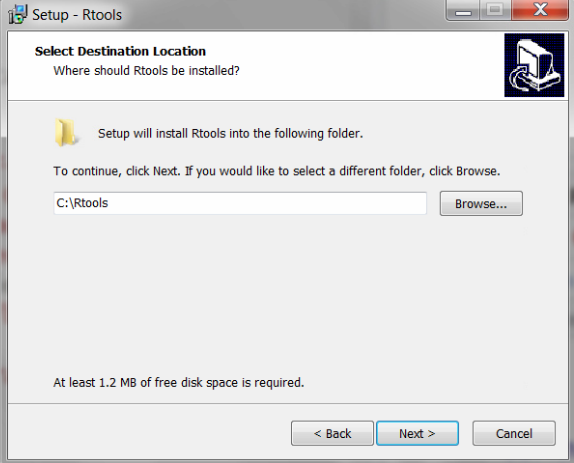
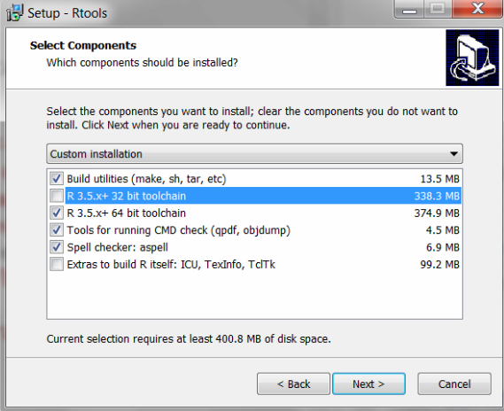
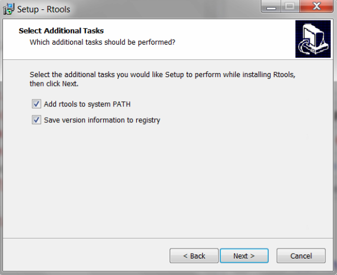
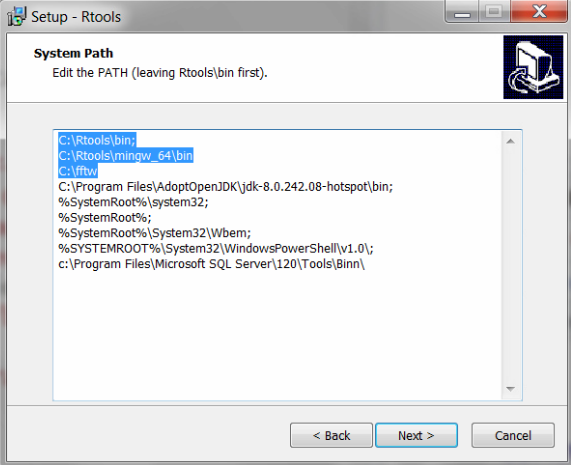

```{r setup, include=FALSE}
knitr::opts_chunk$set(echo = TRUE, eval = FALSE)
```

## Introduction

These manual contains information to install [wholebrain software](http://www.wholebrainsoftware.org)
Tested on Windows 7 and Windows 10 64-bit. Tested on Ubuntu 18.04 and 19.10.
It was tested on macOS X using the instructions as appear [here](http://www.wholebrainsoftware.org/cms/installing-wholebrain-on-mac-osx/) with minor modifications. Please contribute to make this manual current!

## Install in Windows

This has been tried in Windows 10 and 7. There are small but crucial differences between both installs.

### Install R

Tested R Versions: 3.5.1, 3.5.2, 3.6.1, 3.6.2. You can find the latest version to download R (https://cran.r-project.org/bin/windows/base/) 

By default, R will install in `C:\Program Files\R`. This might create a problem with your libraries due to the space between "Program" and "Files". If you choose to install in "Program Files", please make sure your library path does not contain any spaces (check info for `installr::create.global.library()`) To avoid problems you can also install R into:

```
C:\R
```

Under Select Components, choose "64-bit User Installation."

> Make sure to uncheck any files associated with the 32-bit installation!

**[OPTIONAL]**: Under Customize Startup, choose "SDI (separate windows)"


### Install Rstudio

Tested: 1.1.463 Probably works: Latest version (https://www.rstudio.com/) 

RStudio is not strictly necessary, one can launch R and use it from within a DOS-like command window. But installing and using RStudio makes R easier to use and has several conveniences. Also, the author of Wholebrain uses it, so when corresponding with the author or power users about Wholebrain, they will usually assume you are using RStudio when describing how to do things, so it is worth becoming familiar with it if you aren't already! 

> Warning: RStudio might install Rtools to `C:\RBuildTools` and not to `C:\Rtools` which is required by the Wholebrain installation. You have two options, 1) stick to installing Rtools manually or 2) follow these instructions and you won’t encounter a path error.  

RStudio should find your 64-bit installation of R. RStudio will ask you where R is, if you didn't install R yet. Quit and install R first if that happens. I tried installing RStudio first, just to see if RStudio includes R. It does not! RStudio asked me to locate R the first time it ran and operated normally afterwards. 

RStudio should end up here: 

```
C:\Program Files\Rstudio
```

Once RStudio is working, please install the devtools package from CRAN. Just copy and paste the lines below to the console, then press “Enter” to run the command: 

```{r}
install.packages("devtools")
```

You can also install the devtools package conveniently by going into the "Tools" menu, and choosing "Install Packages...", then typing "devtools".

### Install FFTW

Tested 3.3.5. Probably works in latest versions.
The Fastest Fourier Transform in The West (FFTW)! Always loved that name. 

Download FFTW 3.3.5 (ftp://ftp.fftw.org/pub/fftw/fftw-3.3.5-dll64.zip) Unzip to download folder, then create this folder:

```
C:\fftw
```

And copy these two files into it:

```
fftw3.h
libfftw3-3.dll
```
We install it here before Rtools, because we want to add FFTW to the System PATH and the Rtools installer has a step where you can manually edit the PATH directly which is a nice convenience. 

If you for some reason already installed Rtools and didn't add `C:\fftw` to the PATH, you should do it manually. You will be adding an environment variable in the next step anyway, which requires the same instructions, so should be easy to do. 

### Add the LIB_FFTW Environment Variable to Windows 

We will create a new environment variable called LIB_FFTW. Use the `New` button to create the variable, and then fill in its value: `C:\fftw`.



### Install Rtools

We need to build wholebrain ourselves. In Windows, Rtools is needed to build R packages. You can install rtools using the `installr` package.

```{r}
install.packages("installr")
installr::install.rtools()
```

This command will take you to the wizard to properly install rtools. In this install we will use the recommended `Rtools35.exe`. 

> **WARNING:** This wizard is NOT your typical "next-next-next"! Follow the instructions carefully! 



Alternatively, you can manually [download Rtools](https://cran.r-project.org/bin/windows/Rtools/) and follow the steps.

Again, make sure your path goes to `C:\Rtools`.



**WARNING**
It is very important that you only use the tools to build under the proper architecture (for example, 64-bit and not 32-bit). To do this in the installation wizard, under `Select Components`, choose `R toolset, Cygwin DLLs, and R 3.3.x + 64 bit toolchain` not 32-bit! 



Add rtools to PATH



### Set system path for Rtools

You should be able to edit your path through the wizard. Make sure each line of your path finishes with ';'. Your path should look like:

```
C:\Rtools\bin; 
C:\Rtools\mingw_64\bin; 
C:\fftw;
... (leave everything below here alone!) 
```



If you forgot or skipped this convenient part of the Rtools installer, you can add those directories to the PATH manually.
  
Finish the installation.

Check your path! 

```{r}
strsplit(Sys.getenv("PATH"), ";")
```

Make sure each line contains only one path (if you forgot to add the ';' you will see two paths on the same line), you should see something similar to this:

```
[[1]]
 [1] "c:\\Program Files\\R\\R-3.6.3\\bin\\x64"                                     
 [2] "C:\\Rtools\\bin"                                                             
 [3] "C:\\Rtools\\mingw_64\\bin"                                                   
 [4] "C:\\fftw"
 [5] "C:\\Program Files\\AdoptOpenJDK\\jdk-8.0.242.08-hotspot\\bin"        
 [6] "C:\\windows\\system32"                                                       
 [7] "C:\\windows"                                                                 
 [8] "C:\\windows\\System32\\Wbem"                                                 
 [9] "C:\\windows\\System32\\WindowsPowerShell\\v1.0\\"                            
 [10] "c:\\Program Files\\Microsoft SQL Server\\120\\Tools\\Binn\\"                 
[11] "C:\\Users\\Lightsheet\\AppData\\Local\\Programs\\Python\\Python38\\Scripts\\"
[12] "C:\\Users\\Lightsheet\\AppData\\Local\\Programs\\Python\\Python38\
```


### Tools

Because you updated PATH, you should restart Rstudio or your R terminal. Check that Rtools is working by running:

```{r}
pkgbuild::find_rtools(TRUE)
```

and

```{r}
pkgbuild::has_build_tools()
# TRUE
```

and 

```{r}
pkgbuild::check_build_tools()
# Your system is ready to build packages!
```


You can also check your compiler by running:

```{r}
pkgbuild::check_compiler(debug = TRUE)
```

If you don't have CMake, you will get

```
Trying to compile a simple C file
Running "c:/PROGRA~1/R/R-36~1.3/bin/x64/Rcmd.exe" SHLIB \
  foo.c
Warning message:
In system(cmd) : 'make' not found
Error: Failed to compile C code
```

You are going to install CMake in the next step, so don't worry too much about the compiler now.

### Install CMake

Tested: 3.13.0-rc3 Probably works for new versions. Latest version (https://cmake.org/download/) 

You can install CMake using the `installr` package:

```{r}
installr::install.cmake() # might fail because CMake updated website
# Try this release if fails
installr::install.URL("https://github.com/Kitware/CMake/releases/download/v3.16.5/cmake-3.16.5-win64-x64.msi")
```


Alternatively, you can manually [download CMake](https://cmake.org/download/) and install to its default location. 

If you are running it, quit Rstudio to update the system PATH values on Rstudio. RStudio will need CMake to compile Wholebrain and the packages it depends upon, and it will look up CMake's location in the system PATH (that RStudio stores when it launches). 

CMake should add itself to path for you. But, if you forgot to check the box during CMake install, you can add it (or double check) yourself using the instructions for doing it manually via set environment variables.

The path should be:

```
C:\Program Files\CMake\bin 
```

You can check things are OK by running:

```{r}
path_variables <- unlist(strsplit(Sys.getenv("PATH"), ";"))
grep("CMake", path_variables, value=TRUE)
# should return C:\\Program Files\\CMake\\bin 
```


Again, check compiler.

```{r}
pkgbuild::check_compiler(debug = TRUE)
```

You should get something similar to:

```
Running "c:/PROGRA~1/R/R-36~1.3/bin/x64/Rcmd.exe" SHLIB foo.c
c:/Rtools/mingw_64/bin/gcc  -I"c:/PROGRA~1/R/R-36~1.3/include" -DNDEBUG          -O2 -Wall  -std=gnu99 -mtune=core2 -c foo.c -o foo.o
c:/Rtools/mingw_64/bin/gcc -shared -s -static-libgcc -o foo.dll tmp.def foo.o -Lc:/PROGRA~1/R/R-36~1.3/bin/x64 -lR
 
[1] TRUE
```


### Install `rstan`

In the R console, run:

```{r install-rstan-windows}
install.packages("rstan", dependencies = TRUE)
```

#### Possible errors 

```
“failed to create lock directory”
```

**Solution:**

Check the path where R installs the libraries. You might not have writing permissions or there might be 
```
install.packages("rstan", dependencies = TRUE, INSTALL_opts = c('--no-lock'))
```

***

It's possible that you get errors related to StanHeaters and Rccp not finding files.

**Solution:**

This is a known issue (and many people are really angry about it on different forums...). The recommended solution it to make a "makefile":

Check your package versions, it's likely that `StanHeaders` is a newer version than `rstan` and that creates chaos.

```{r}
packageVersion(c("rstan")) # '2.19.2' is the last tested one
packageVersion(c("StanHeaders")) # '2.19.0' is the last one that actually works with rstan!
```

It's likely that the `StanHeaders` installation from CRAN gave you an updated package. If that's the case, remove everyhing and start over.

```{r}
remove.packages("rstan")
remove.packages("StanHeaders")
```


Close Rstudio and open it again. Run this install.

```{r}
devtools::install_version("StanHeaders", version = "2.19.0", repos = "http://cran.us.r-project.org")
install.package("rstan")
```

Now try `rstan`.

> rstan is a particularly annoying thing, if you are still facing issues with rstan, don't assume it's you, it's likely rstan!

There's advice here (but it probably doesn't work, so don't try that unless our solution doesn't work):

https://github.com/stan-dev/rstan/wiki/Installing-RStan-from-source-on-Windows#configuration

### Try `rstan` 

It is imperative that you check that `rstan` works before you continue with the pipeline. Check that the `rstan` package is working, do:

```{r}
library(rstan)
model<-'data{
int N;
real y[N];
}
parameters{
real mu;
real sigma;
}
model{
y ~ normal(mu, sigma);
}'


model_data <- list( y = rnorm(10), N = 10  )
fit <- stan(model_code = model, data = model_data, iter = 4000, chains =4)
la <- extract(fit)
hist(la$mu)
```

It should produce something similar to this plot:

```{r, eval=TRUE, echo=FALSE}
knitr::include_graphics("histogram.png")
```


### Install `ROpenCVLite`

```{r}
install.packages("ROpenCVLite", INSTALL_opts = "--no-multiarch")
# you can also specify a particular version from github
# devtools::install_github("swarm-lab/ROpenCVLite", ref = "v0.3.410", INSTALL_opts="--no-multiarch") 
```


### Install Opencv

Check whether opencv is installed in your system. Having multiple versions of opencv can lead to issues.

```{r}
ROpenCVLite::isOpenCVInstalled()
```

You should install opencv from `ROpenCVLite`, so R knows where to find it. This operation will take some minutes and you will see a lot of console output.

```{r}
ROpenCVLite::installOpenCV()
```

There might be multiple issues during the install. File specific issues to make 

You can check your system has opencv by running again:

```{r}
ROpenCVLite::isOpenCVInstalled()
```

Opencv should build successfully (it will require CMake be installed correctly.) We can now add the opencv path to the System PATH, now that opencv is installed. 

Quit Rstudio.

This time we need to update the system PATH manually, no help from installers. I find it this way in Windows 10: 

This PC -> Right click -> Properties -> Advanced System Settings -> Environment Variables... -> System variables


Then add the R and ROpenCVLite locations on the end so that the list looks like this (your "%System" lines may be different)


```
c:\Rtools\bin 
c:\Rtools\mingw_64\bin 
c:\fftw 
%SystemRoot%\system32 
%SystemRoot% 
%SystemRoot%\System32\Wbem 
%SYSTEMROOT%\System32\WindowsPowerShell\v1.0\ 
%SYSTEMROOT%\System32\OpenSSH\ 
C:\Program Files\CMake\bin 
C:\Program Files\R\R-3.5.1\bin\x64 
C:\Users\[user_name]\Documents\R\win-library\3.5\ROpenCVLite\opencv\x64\mingw\bin 
```

Please make sure that the user folder specific path for `ROpenCVLite` is assigned correctly. The example above is specific to Ben D. Singer’s computer. Generally, the R package folder will be located at the general path pattern: 

```
C:\Users\[user_name]\Documents\R\win-library\[R-version]\ROpenCVLite\opencv\x64\mingw\bin
```

If you are in doubt about where your R packages are installed, you can check from any R terminal.

```{R}
.libPaths()
```

If you can't find opencv within ROpenCVLite, check your library installation. It could be here:

`C:\R\[R-version]\opencv\x64\mingw\bin`

> NOTE: If you encounter an error during installation of ROpenCVLite in your Windows machine with CMake recognizing your Rtools compilers, try setting either the CMake path to the top of your Paths variables, or the Rtools paths to the top of your Paths variables. This has worked on a few Windows machines. 

### Install `wholebrain`

Ensure that you quit RStudio, since the system PATH has changed. Then start it up again.

```{r}
devtools::install_github("tractatus/wholebrain", args="--no-multiarch") 
```

### Try `wholebrain`

You should be able to run the segmentation example below

```{r}
library(wholebrain) 
filename<-system.file('sample_tiles/rabiesEGFP.tif', package='wholebrain') 
seg<-segment(filename) 
```

#### Possible errors

Error loading `wholebrain.dll` 

Make sure the PATH contains the location of R and ROpenCVLite libraries. 

## Install in Ubuntu

It might sound obvious, but it's usually good practice before big installs.

```{}
sudo apt-get update
sudo apt-get upgrade
```


### Required libraries

Begin by installing required libraries from terminal:

```
sudo apt-get install fftw3 fftw3-dev pkg-config
```

```
sudo apt-get install libgtk2.0-dev pkg-config libavcodec-dev libavformat-dev libswscale-dev
```


### Install R

If you don't have R already installed

```
# Add repo to install the last R
sudo apt install apt-transport-https software-properties-common
sudo apt-key adv --keyserver keyserver.ubuntu.com --recv-keys E298A3A825C0D65DFD57CBB651716619E084DAB9
sudo add-apt-repository 'deb https://cloud.r-project.org/bin/linux/ubuntu disco-cran35/'

# Install R
sudo apt update
sudo apt install gdebi libxml2-dev libssl-dev libcurl4-openssl-dev libopenblas-dev r-base r-base-dev
```

You should be able to start R from a terminal 

```
R
```

and see the startup message

```
R version 3.6.2 (2019-12-12) -- "Dark and Stormy Night"
Copyright (C) 2019 The R Foundation for Statistical Computing
Platform: x86_64-pc-linux-gnu (64-bit)

R is free software and comes with ABSOLUTELY NO WARRANTY.
You are welcome to redistribute it under certain conditions.
Type 'license()' or 'licence()' for distribution details.

  Natural language support but running in an English locale

R is a collaborative project with many contributors.
Type 'contributors()' for more information and
'citation()' on how to cite R or R packages in publications.

Type 'demo()' for some demos, 'help()' for on-line help, or
'help.start()' for an HTML browser interface to help.
Type 'q()' to quit R.

> 

```

### Install Rstudio

To install Rstudio run from a terminal.

```
cd ~/Downloads
wget https://download1.rstudio.org/desktop/bionic/amd64/rstudio-1.2.5001-amd64.deb
sudo gdebi rstudio-1.2.5001-amd64.deb
```


### Install `rstan`

In the R console, run:

```{r install-rstan}
install.packages("rstan", dependencies = TRUE)
```

#### Possible errors 

```
“failed to create lock directory”
```
#### Solutions  

Check the path where R installs the libraries. You might not have writing permissions or there might be 

```
install.packages("rstan", dependencies = TRUE, INSTALL_opts = c('--no-lock'))
```

### Try `rstan` 

Check that the `rstan` package is working.


```{r}
model<-'data{
int N;
real y[N];
}
parameters{
real mu;
real sigma;
}
model{
y ~ normal(mu, sigma);
}'


model_data <- list( y = rnorm(10), N = 10  )
fit <- stan(model_code = model, data = model_data, iter = 4000, chains =4)
la <- extract(fit)
hist(la$mu)
```

It should produce something similar to this plot:

```{r, eval=TRUE, echo=FALSE}
knitr::include_graphics("histogram.png")
```

### install `rgl`

```{r}
install.packages("rgl")
```

#### Possible errors

Problems with X11, which is needed for graphic display by `rgl` and `wholebrain`. 

```
configure: error: X11 not found but required, configure aborted.
```

> Solution:
> See [this post](https://stackoverflow.com/questions/34264324/install-rgl-on-r-server-ubuntu) and [this post](https://stackoverflow.com/questions/31820865/installing-rgl-on-ubuntu-and-mac-x11-not-found), which helped fix the issue by running from command line:

```
sudo apt-get install libcgal-dev libglu1-mesa-dev libglu1-mesa-dev
```

You can also find errors like `'No package 'freetype2' found'`

> Solution:
> Go to the terminal and run

```
sudo apt-get libfreetype6-dev
```

Retry `install.packages("rgl")`

### Check `rgl` works

You should be able to call `rgl::plot3d()` and see the following 3d scatterplot:

```{r}
rgl::plot3d(x=rnorm(1000), y=rnorm(1000), z=rnorm(1000))
```


### Install cmake

CMake is needed to compile code. Open a terminal (Ctrl + Alt + T) and do:

```
sudo apt-get install cmake
```

### Install ROpenCVLite

```{r}
install.packages("ROpenCVLite")
```

### Install Opencv

Check whether opencv is installed in your system. Having multiple versions of opencv can lead to issues.

```{r}
ROpenCVLite::isOpenCVInstalled()
```

You should install opencv from `ROpenCVLite`, so R knows where to find it. This operation will take some minutes and you will see a lot of console output.

```{r}
ROpenCVLite::installOpenCV()
```

There might be multiple issues during the install. File specific issues to make 

You can check your system has opencv by running again:

```{r}
ROpenCVLite::isOpenCVInstalled()
```

### Tools

Your system should have the ability to build packages. You can check this by running:

```{r}
pkgbuild::has_build_tools()
```

and 

```{r}
pkgbuild::check_build_tools()
```


You can also check your compiler by running:

```{r}
pkgbuild::check_compiler(debug = TRUE)
```


### Install `wholebrain`

This is the command to install `wholebrain`, installing also any dependencies that might be missing. The `INSTALL_opts = c("--no-multiarch")` argument  

```{r}
devtools::install_github("tractatus/wholebrain", dependencies = TRUE, INSTALL_opts = c("--no-multiarch"))
```

### Try `wholebrain`

You should be able to run the segmentation example below

```{r}
library(wholebrain) 
filename<-system.file('sample_tiles/rabiesEGFP.tif', package='wholebrain') 
seg<-segment(filename) 
```


## Install in macOS

## Issues

The amount of things that can go bad is substantial, please file issues to https://github.com/matiasandina/wholebrain_install/issues

## Contribute

This guide was originally written by Ben D. Singer and Matias Andina. Please contribute with updates by filing issues to keep it current. 